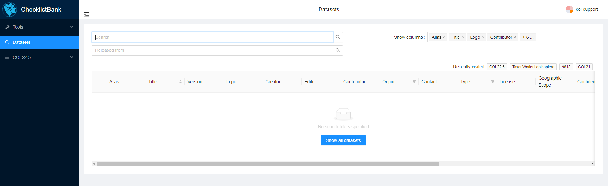
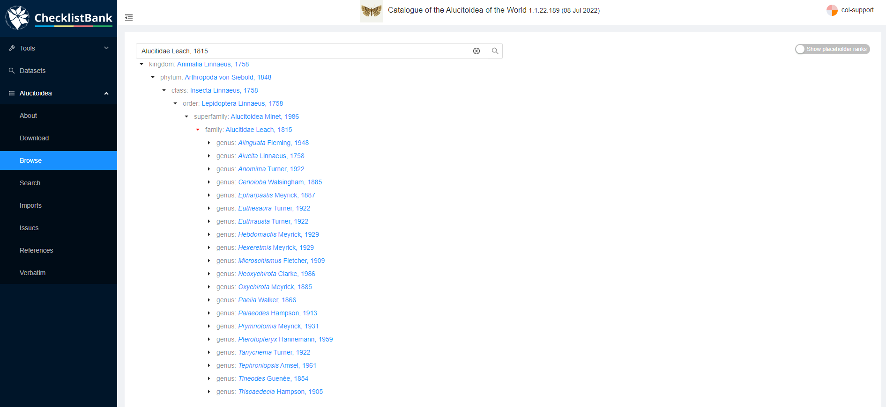

[multipage-level=2]
== Explore the ChecklistBank repository

ChecklistBank includes >40,000 taxonomic checklists. You can search through these checklists and discover their metadata, browse taxon names, and also download the checklist in various formats.

Please make sure you are logged in to ChecklistBank. If you don't know how to do that, follow the steps here.

*Search for a checklist*

Click on Datasets in the menu on the left. This will bring you to the dataset search page.

You can use the Search field to type any keyword of the checklist you are searching for. Here are a few suggestions that you can use for this tutorial:

- search 'Annual Checklist 2021' : this will only give 1 result, the Catalogue of Life Checklist 2021.
- search 'Carabcat': the top result shows the Carabcat checklist, a global database of ground beetles, but additionally it will also show COL Checklists in which this checklist was included (since 2021).
- search 'Foraminifera': the top result shows the WoRMS Foraminifera checklist, below that the COL Checklists in which this checklist was included, and also a range of additional checklists that have been published in GBIF.

*Explore a checklist*

Let’s have a closer look at the information you can find for a particular dataset.
In this example, we use the https://www.checklistbank.org/dataset/2207/about[Alucitoidea dataset] by Donald Hobern.

The menu on the left shows various options to explore this dataset:

*About*: here you can find all the metadata about this dataset including the author and contact person, the version of the dataset and date of when it was issued, licensing information and how to cite this source, link to the website of the dataset (if applicable), taxonomic scope, etc.

*Browse*: you can use this page to browse through the taxonomic tree for this particular checklist. This is useful to get a quick overview of which taxonomic levels and names are included in the checklist.

This is the view if you unfold the taxonomic tree for the Alucitoidea checklist:

*Search*:  here you can search for specific taxonomic names. This functionality is most useful if you are looking for a particular name.

*Download*: on this page you can download this dataset in various formats:

* https://dwc.tdwg.org/list/[Darwin Core Archive] (dwca): commonly used standard for biodiversity data.
* Annual Checklist Exchange Format (acef): data format previously used by Catalogue of Life.
* https://github.com/gbif/text-tree[TextTree]: a simple format to represent taxonomic trees using indented, plain text.
* https://github.com/CatalogueOfLife/coldp[Catalogue of Life Data Package] (coldp): this is a tabular text format with a standard set of files and columns recommended for exchanging checklists with the Catalogue of Life. 
* https://en.wikipedia.org/wiki/Newick_format[Newick]: a way of representing graph-theoretical trees with edge lengths using parentheses and commas, often used with phylogenetic data. 
* http://www.graphviz.org/doc/info/lang.html[Graphviz dot]: a simple widely used format for representing graphs as nodes and edges. ChecklistBank exports will include synonym and basionym relations in the final graph that can be rendered with many software tools.

*Imports*

*Issues*

*References*

*Verbatim*

