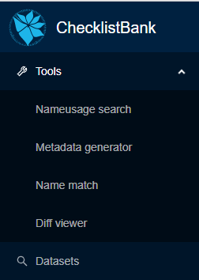

[multipage-level=1]
== Name usage tool

The 'taxonomic name usage search' gives an overview of the appearance of a particular scientific name in all data sources, taxonomic or nomenclatural, available in ChecklistBank.

A 'Taxonomic Name Usage' is a use of a particular scientific name in a particular resource. The resource can either be a dataset itself or it is any other source (e.g. human expert, literature reference) that is provided by a data custodian in the 'accordingTo' data standard term. The tool is helpful in understanding how a scientific name refers to different synonyms and hence a taxonomic concept that is used in a particular dataset or resource. The 'taxonomic name usage search' can be accessed in ChecklistBank. The tool is in production and usable for the wider public.

Please make sure you are logged in to ChecklistBank. If you don't know how to do that, follow the steps here (link back to login tutorial page).

You can find the tool in the menu on the left. Expand the Tools menu by clicking on the arrow. Then click ‘nameusage search’.

=== Example 1: _Quercus robur_ L.

We showcase the functionality and usability of the 'taxonomic name usage search' by using a real example of a search on a scientific name. _Quercus robur_ L. is an oak tree belonging to the family of the Fagaceae with an extensive distribution across Europe.   

