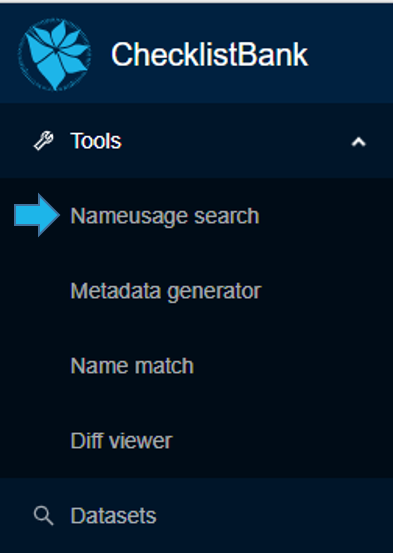
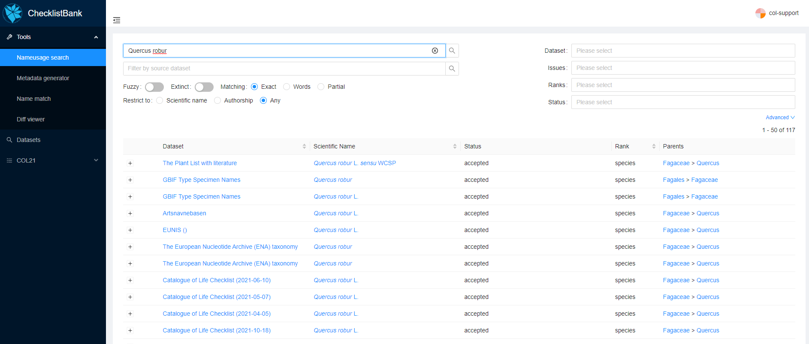
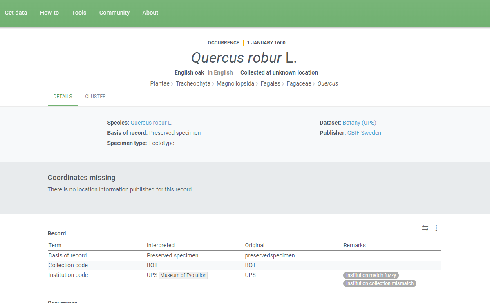

[multipage-level=1]
== Name usage tool

The 'taxonomic name usage search' gives an overview of the appearance of a particular scientific name in all data sources, taxonomic or nomenclatural, available in ChecklistBank.

A 'Taxonomic Name Usage' is a use of a particular scientific name in a particular resource. The resource can either be a dataset itself or it is any other source (e.g. human expert, literature reference) that is provided by a data custodian in the 'accordingTo' data standard term. The tool is helpful in understanding how a scientific name refers to different synonyms and hence a taxonomic concept that is used in a particular dataset or resource. The 'taxonomic name usage search' can be accessed in ChecklistBank. The tool is in production and usable for the wider public.

Please make sure you are logged in to ChecklistBank. If you don't know how to do that, follow the steps here (link back to login tutorial page).

You can find the tool in the menu on the left. Expand the Tools menu by clicking on the arrow. Then click ‘nameusage search’.

=== Example 1: _Quercus robur_ L.

We showcase the functionality and usability of the 'taxonomic name usage search' by using a real example of a search on a scientific name. _Quercus robur_ L. is an oak tree belonging to the family of the Fagaceae with an extensive distribution across Europe.   

1. Type Quercus robur in the search bar
2. Select Exact in the options.

Setting the matching to 'Exact' ensures that all results relate to tree taxa in the family of the Fagaceae plant family. If the matching on 'Words' is used, zoological taxa (for example _Stomaphis quercus_ (Linnaeus, 1758) from the Fauna Europaea dataset would also appear.

The search results show all datasets in ChecklistBank where the scientific name _Quercus robur_ L. appears in.

Through these results, it is possible to explore individual datasets in ChecklistBank which include _Quercus robur_ L. Several options for filtering the search results are also available.

3. Click on the Scientific Name (Quercus robur) for the Dataset ‘GBIF Type Specimen Names’ (the first one in the list).

This brings you to the record of this name, which includes its original resource.

4. Click on the link of the Online Resource.

This brings you to the GBIF webpage for an occurrence record for the scientific name _Quercus robur L., which provides details of the type specimen (a lectotype) for the species. A lectotype is a specimen chosen as the type of a species or subspecies if the author of the name fails to designate a type. 

This example shows that by using the  'taxonomic name usage search' tool, you can make linkages to a biodiversity data infrastructure such as GBIF to explore further evidence of specimen records of a scientific name as deposited in a natural history museum. 

*Exploring synonyms*

You can also check whether the name that you have searched is used as a synonym for other names.

Go back to the search page in the name usage tool, and again search for Quercus robur, select Exact, and under Status, select ‘Synonym’.

You can now see that amongst the resources in ChecklistBank, there are four instances of _Quercus robur_ as a synonym.

