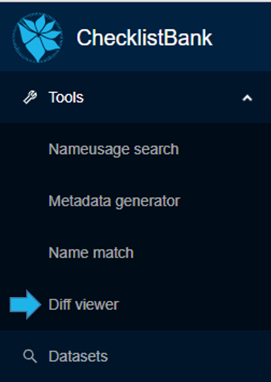

[multipage-level=1]
== Difference viewer

The 'difference viewer' allows for comparison of two taxonomic datasets in ChecklistBank on a scientific name by scientific name basis. 

All datasets in ChecklistBank can be compared including the COL Checklist releases. The tool provides an overview of the differences in scientific names and authorship, if requested, between datasets. 

Please make sure you are logged in to ChecklistBank. If you don’t know how to do that, follow the steps here (link back to login tutorial page).

You can find the tool in the menu on the left. Expand the Tools menu by clicking on the arrow. Then click ‘diff viewer’.

=== Example: _Acacia_ Mill.

