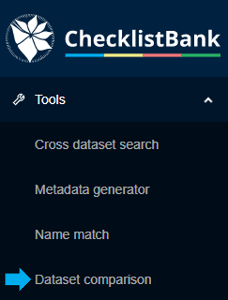
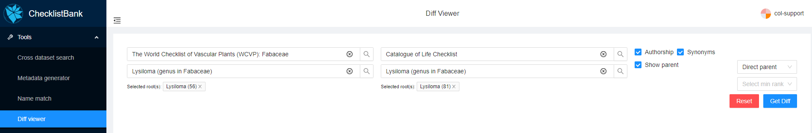
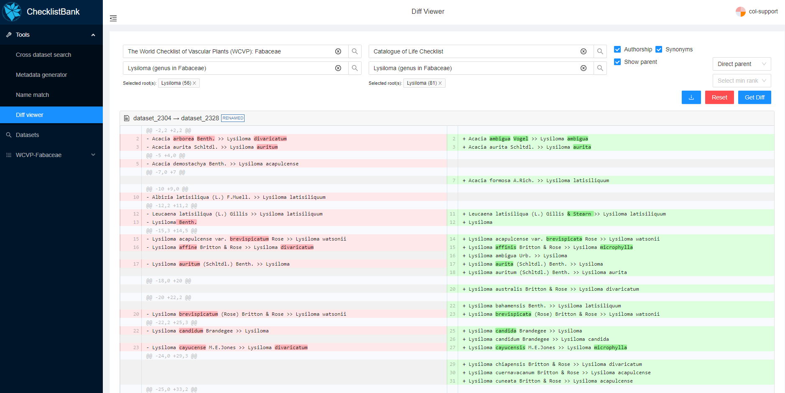

[multipage-level=1]
== Diff viewer

The 'diff viewer' allows for comparison of two taxonomic datasets in ChecklistBank on a scientific name by scientific name basis. 

All datasets in ChecklistBank can be compared including the COL Checklist releases. The tool provides an overview of the differences in scientific names between datasets. The set of names to be compared can be filtered by various parameters, and a root taxon can also be selected to include only a certain group. Synonyms and names below a certain rank can be excluded on demand, i.e. you can just compare accepted genera or families.

Please make sure you are logged in to ChecklistBank. If you don't know how to do that, follow the steps <<ChecklistBank login,here>>.

You can find the tool in the menu on the left. Expand the Tools menu by clicking on the arrow. Then click ‘Diff viewer’.

=== Example: Lysiloma (genus in Fabaceae)

We use the Fabaceae checklist, which was also used in the ‘name match tool’ tutorial. We compare this list to the 2021 COL Checklist for which the data on the genus Lysiloma are provided by the ILDIS World Database of Legumes checklist (Roskov et al. 2014).

When you open the tool, the start screen of the 'diff viewer' allows you to choose two datasets to make the comparison on the basis of scientific names. 

Step 1. For dataset 1: start typing WCVP-Fabaceae and this dataset will appear in the menu. Select it. 

Step 2. For dataset 2: type COL 2021, and select the COL21 Annual Checklist 2021.

Step 3. For both datasets, select Lysiloma (genus) in the boxes ‘Find taxon’.

You can choose whether the scientific name comparisons should include authorship and synonyms, and whether the parent should be shown in the results. For this example, select all three boxes.

Step 4. Once you have made your selection, click ‘Get diff’.

*Results*

The results of the comparison can be explored in the webpage. 

You can see two columns, one for each dataset. Scientific name differences are shown in each column where a '-' or '+' sign indicates in which dataset the difference occurs. The results of the comparisons can also be downloaded in a CSV file for further investigation.

