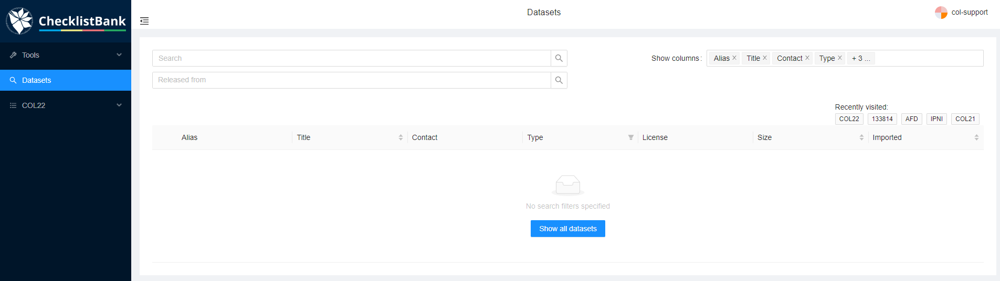
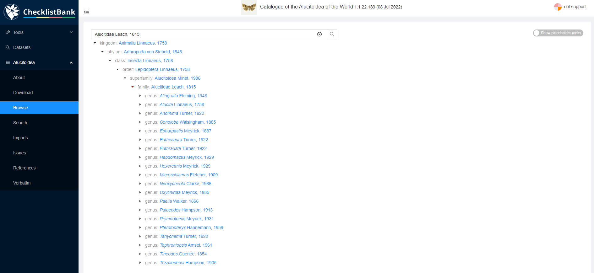

[multipage-level=1]
== Explore the ChecklistBank repository

ChecklistBank is a public repository including over 40,000 taxonomic checklists. It is established to simplify FAIR data sharing for taxonomic and nomenclatural lists. It allows contributors to publish lists using a variety of typical data formats. Each list is then accessible through a standard API and reusable web browser components and can be cited using a ChecklistBank Digital Object Identifier. 

Data publishers benefit both by making their datasets accessible for reuse and attribution and also through ChecklistBank tools for data review and detection of possible issues. Some of the datasets in ChecklistBank serve as authoritative sources for sections of the Catalogue of Life Checklist, and new releases of the COL Checklist are also published as ChecklistBank datasets.

You can search through the ChecklistBank repository and explore the information and content of each checklist. All checklists can also be downloaded in multiple formats.

Before you start, please make sure you are logged in to ChecklistBank. If you don't know how to do that, follow the steps <<ChecklistBank login,here>>.

=== Search for a checklist

Click on Datasets in the menu on the left. This will bring you to the dataset search page.

You can use the Search field to type any keyword of the checklist you are searching for. Here are a few suggestions that you can use for this tutorial:

- search 'COL22' : this will only give 1 result, the Catalogue of Life Checklist 2022.
- search 'Carabcat': the top result shows the Carabcat checklist, a global database of ground beetles, but additionally it will also show COL Checklists in which this checklist was included (since 2021).
- search 'Foraminifera': the top result shows the WoRMS Foraminifera checklist, below that the COL Checklists in which this checklist was included, and also a range of additional checklists that have been published in GBIF.

=== Explore a checklist

Let’s have a closer look at the information you can find for a particular dataset.
In this example, we use the https://www.checklistbank.org/dataset/2207/about[Alucitoidea dataset] by Donald Hobern.

The menu on the left shows various options to explore this dataset:

*About*: here you can find all the metadata about this dataset including the author and contact person, the version of the dataset and date of when it was issued, licensing information and how to cite this source, link to the website of the dataset (if applicable), taxonomic scope, etc.

*Browse*: you can use this page to browse through the taxonomic tree for this particular checklist. This is useful to get a quick overview of which taxonomic levels and names are included in the checklist.

This is the view if you unfold the taxonomic tree for the Alucitoidea checklist:

*Search*:  here you can search for specific taxonomic names. This functionality is most useful if you are looking for a particular name.

*Download*: on this page you can download this dataset in various formats:

- https://dwc.tdwg.org/list/[Darwin Core Archive] (dwca): commonly used standard for biodiversity data.
- Annual Checklist Exchange Format (acef): data format previously used by Catalogue of Life.
- https://github.com/gbif/text-tree[TextTree]: a simple format to represent taxonomic trees using indented, plain text.
- https://github.com/CatalogueOfLife/coldp[Catalogue of Life Data Package] (coldp): this is a tabular text format with a standard set of files and columns recommended for exchanging checklists with the Catalogue of Life. 
- https://en.wikipedia.org/wiki/Newick_format[Newick]: a way of representing graph-theoretical trees with edge lengths using parentheses and commas, often used with phylogenetic data. 
- http://www.graphviz.org/doc/info/lang.html[Graphviz dot]: a simple widely used format for representing graphs as nodes and edges. ChecklistBank exports will include synonym and basionym relations in the final graph that can be rendered with many software tools.

For your download you have the following optional options to select a subset of the checklist to be included in the download. This can be useful if you only want to download a selection of a large checklist.

- Choose root taxon: you can select a taxon within the checklist that will be the top level for the data included in your download. This means only taxonomic levels from this root level and further down are selected. +
For example, if we choose 'Cenoloba' here as root taxon, only this genus and the species within this genus would be included in the download.
- Exclude ranks below: select the highest taxonomic level you want to include in the download. +
For example, if we choose ‘genus’ all levels below will be excluded, thus species will not be listed.

The download consists of a zip file containing several tsv files of which the file ‘NameUsage.tsv’ includes the names in the checklist. 

*Imports*: this shows the history and metrics of the import of this checklist into ChecklistBank including the different versions of the checklist. The timeline compares counts across imports, making it possible to see the growth in taxon counts, new datatypes added, etc. +
Note: for the Catalogue of Life monthly and annual releases, the Imports is not available, because each release is a new checklist. For these checklists, there is just a Metrics page.

*Issues*: this lists the issues found by automatic checks. When you hover your mouse over a particular issue it will show the definition of that issue. A full list of all issues can be found http://api.checklistbank.org/vocab/issue[here]. +
When you click on the count number it will take you to the search page displaying the names with that particular issue.

*References*: these are the references used to generate this checklist.

*Verbatim*: this shows the exact data as it was supplied without any alterations done by the importer to best fit the ChecklistBank data model. You can perform a full text search and browse the csv files. This page can be useful for data providers in debugging why ChecklistBank has interpreted things in a particular way, but also for others to search the original data and browse it.

