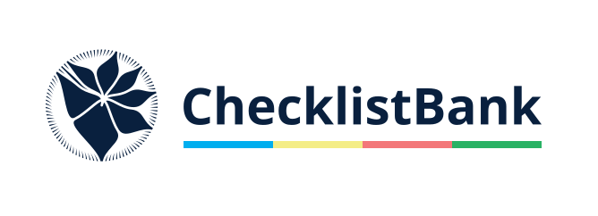

= ChecklistBank tutorial
Catalogue of Life <support@catalogueoflife.org>
//GBIF Secretariat <training@gbif.org>
:multipage:
:multipage-level: 1
:toc: left
:toclevels: 3
:numbered:
:revnumber: 1
:revdate: June 2023
:title-page-background-image: image::img/logos/clb-col-dark.svg[position=top center]
:license: https://creativecommons.org/licenses/by/4.0
:docinfo: shared-head
// :stylesheet: /adoc/gbif-stylesheet/stylesheets/gbif-training.css

ifndef::backend-pdf[]
languageLinks:combined[]
endif::backend-pdf[]

// add cover image to img directory and update filename below
ifndef::backend-pdf[]
:figure-caption!:

endif::backend-pdf[]

:sectnums!:

include::description.en.adoc[]

include::login.en.adoc[]

include::explore-clb.en.adoc[]

include::name-usage.en.adoc[]

include::name-match.en.adoc[]

include::diff-viewer.en.adoc[]

include::glossary.en.adoc[]

include::colophon.en.adoc[]
