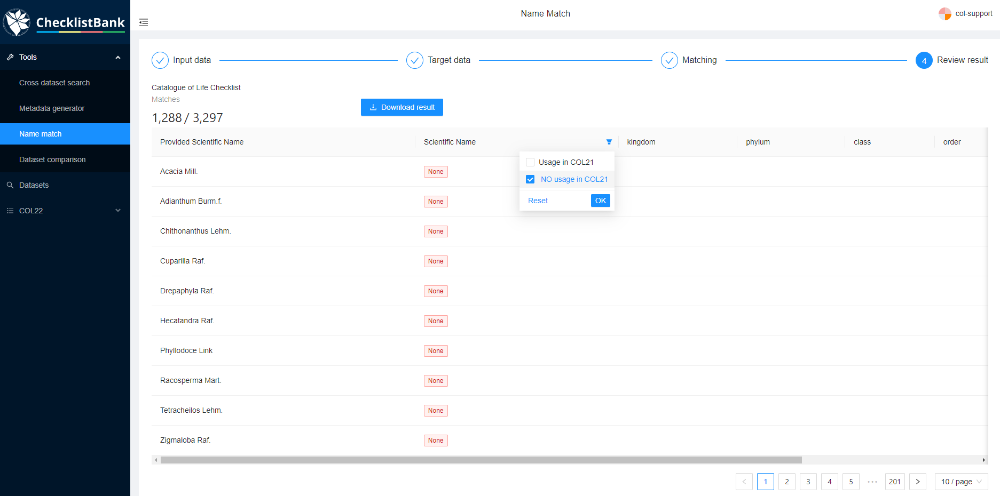

[multipage-level=1]
== Name match tool

The 'name match' tool in ChecklistBank enables comparison of any checklist against one or two other datasets in ChecklistBank in terms of taxon name matching. There is a limit to matching a maximum of 6000 taxon names in one request.

Please make sure you are logged in to ChecklistBank. If you don't know how to do that, follow the steps <<ChecklistBank login,here>>. You can find the tool in the menu on the left. Expand the Tools menu by clicking on the arrow. Then click ‘Name match’.

image::img/web/CLB-tools-match.png[align=left, width=300]

The user interface guides you through the steps to match your lists of interest.

Step 1: Select your input data.

There are three different options for your input data:

1. Simply paste a list of names in the text box. Use one name per row, and names can include author string.

2. Upload a csv file with a list of names.
This csv file must contain at least a column with the header 'scientificName' and optional columns 'author', 'rank', 'code'.

3. Choose a dataset in ChecklistBank.
You can select any checklist from the ChecklistBank repository. If this is a large checklist, it might be helpful to select a root taxon. The matching is then done for all names below the root taxon, ignoring higher taxonomic levels.

Step 2: Select the target data.

The default selection for the target data is the latest release of the COL Checklist. It is also possible to select a different checklist from ChecklistBank, or even match against two datasets.

Step 3: Matching.

Step 4: Review result.

The results of the matchings can be explored in web pages in ChecklistBank or downloaded as a CSV file.

=== Example: Acacia Mill.

In this tutorial, we showcase the functionality of the name match tool with a comparison of the genus _Acacia_ Mill. in the plant family Fabaceae.

When you open the tool, the Catalogue of Life Checklist is already selected. This is always the latest release.

Step 1. Select the ‘WCVP-Fabaceae [2304]’ dataset under ‘Or select a subject dataset’. +
This is a dataset from the Legume Phylogeny Working Group 2021, which is a group of Fabaceae specialists that have worked on a comprehensive global taxonomic list for this taxon. +
You can type the first letters and then a drop down will appear.

Note that you can also upload your own csv file here, but for the tutorial we use an already existing checklist in ChecklistBank.

Step 2. Choose under ‘And a root taxon’ the genus Acacia.
A blue box will appear with the number of names that will be matched.

Step 3. Click Match

image::img/web/CLB-match-Acacia.png[align=center]

*Results*

The results of the matching can either be explored in a web page or downloaded as a CSV file.

The first column lists the scientific name from the provided dataset (in this case the Fabaceae dataset). +
The ‘Scientific Name’ column has a filter in which you can select whether you want to view the names that are also listed in the COL Checklist (usage in COL), or the names that do not have a match (NO usage in COL).

