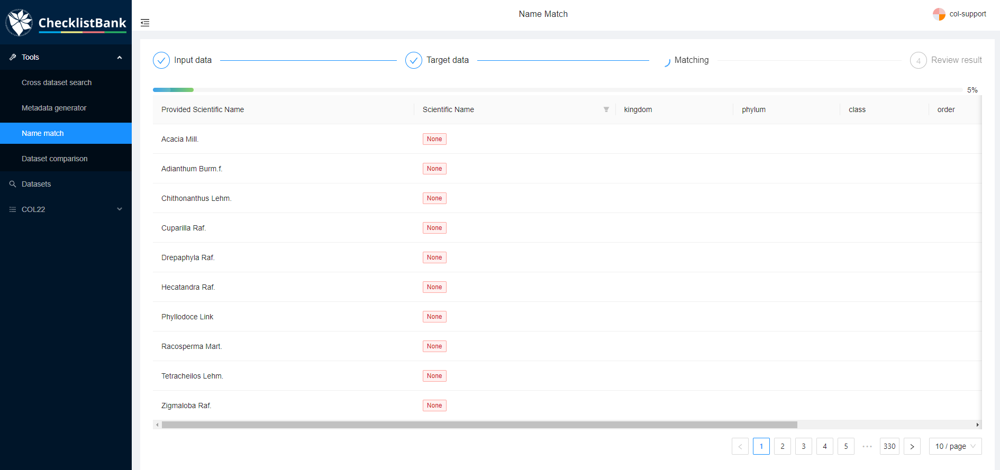

[multipage-level=1]
== Name match tool

The 'name match' tool in ChecklistBank enables comparison of the Catalogue of Life (COL) Checklist with one or two other datasets in ChecklistBank in terms of taxon name matching. 

Matching is performed against the COL Checklist, by default this is always performed against the latest release of the COL Checklist. It is also possible to compare two datasets without any matching against the COL Checklist. 

To use this tool, you can upload a custom CSV file for comparison. Please note that there is a limit to matching a maximum of 6000 taxon names in one request. The results of the matchings can be explored in web pages in ChecklistBank or downloaded as a CSV file.

Please make sure you are logged in to ChecklistBank. If you don't know how to do that, follow the steps https://docs.gbif-uat.org/course-checklistbank-tutorial/en/checklistbank-login.html[here].

You can find the tool in the menu on the left. Expand the Tools menu by clicking on the arrow. Then click ‘Name match’.

=== Example: Acacia Mill.

In this tutorial, we showcase the functionality of the name match tool with a comparison of the genus _Acacia_ Mill. in the plant family Fabaceae.

When you open the tool, the Catalogue of Life Checklist is already selected. This is always the latest release.

Step 1. Select the ‘WCVP-Fabaceae [2304]’ dataset under ‘Or select a subject dataset’. +
This is a dataset from the Legume Phylogeny Working Group 2021, which is a group of Fabaceae specialists that have worked on a comprehensive global taxonomic list for this taxon. +
You can type the first letters and then a drop down will appear.

Note that you can also upload your own csv file here, but for the tutorial we use an already existing checklist in ChecklistBank.

Step 2. Choose under ‘And a root taxon’ the genus Acacia.
A blue box will appear with the number of names that will be matched.

Step 3. Click Match

*Results*

The results of the matching can either be explored in a web page or downloaded as a CSV file.

The first column lists the scientific name from the provided dataset (in this case the Fabaceae dataset). +
The ‘Scientific Name’ column has a filter in which you can select whether you want to view the names that are also listed in the COL Checklist (usage in COL), or the names that do not have a match (NO usage in COL).

image::img/web/CLB-match-result.png[align=center]

