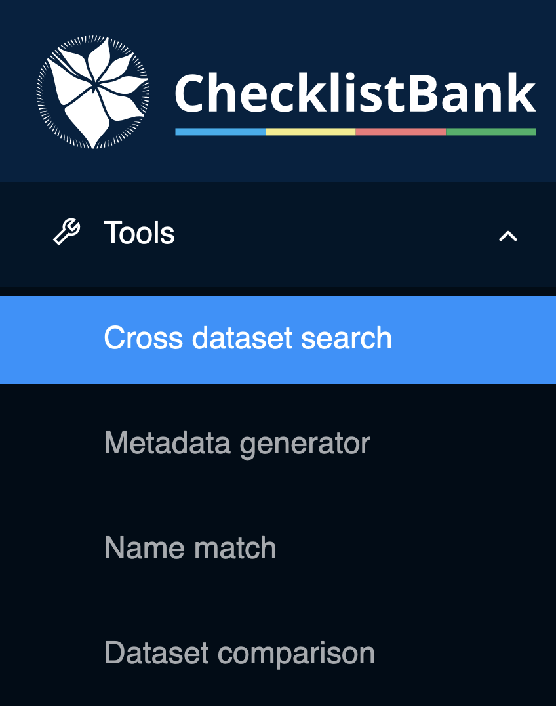

[multipage-level=1]
== Cross dataset search

The 'cross dataset search' tool gives an overview of the appearance of a particular scientific name in all data sources, taxonomic or nomenclatural, that are available in ChecklistBank.

A 'Taxonomic Name Usage' is a use of a particular scientific name in a particular resource. The resource can either be a dataset itself or it is any other source (e.g. human expert, literature reference) that is provided by a data custodian in the 'accordingTo' data standard term. The tool is helpful in understanding how a scientific name refers to different synonyms and hence a taxonomic concept that is used in a particular dataset or resource. The 'cross dataset search' tool can be accessed in ChecklistBank.

Please make sure you are logged in to ChecklistBank. If you don't know how to do that, follow the steps <<ChecklistBank login,here>>.

You can find the tool in the menu on the left. Expand the Tools menu by clicking on the arrow. Then click ‘Cross dataset search’.

=== Example: _Quercus robur_ L.

We showcase the functionality and usability of the 'cross dataset search' tool by using a real example of a search on a scientific name. _Quercus robur_ L. is an oak tree belonging to the family of the Fagaceae with an extensive distribution across Europe.   

Step 1: Type Quercus robur in the search bar.

Step 2: Select Exact in the options.

Setting the matching to 'Exact' ensures that all results relate to tree taxa in the family of the Fagaceae plant family. If the matching on 'Words' is used, zoological taxa (for example _Stomaphis quercus_ (Linnaeus, 1758) from the Fauna Europaea dataset would also appear.

The search results show all datasets in ChecklistBank where the scientific name _Quercus robur_ L. appears in.

image::img/web/CLB-name-usage.png[align=center]

Through these results, it is possible to explore individual datasets in ChecklistBank which include _Quercus robur_ L. Several options for filtering the search results are also available.

Step 3: Click on the Scientific Name (Quercus robur L.) for the Dataset ‘World Checklist of Selected Plant Families’.

This brings you to the record of this name, which includes its original resource.

Step 4: Click on the link of the Online Resource.

This brings you to the information page about this name of the original source, in this case the International Plant Names Index (IPNI).

This example shows that by using the 'cross dataset search' tool, you can make linkages to other infrastructures to explore further evidence of a scientific name.

*Exploring synonyms*

You can also check whether the name that you have searched is used as a synonym for other names.

Go back to the search page in the 'cross dataset search' tool, and again search for Quercus robur, select Exact, and under Status, select ‘Synonym’.

You can now see that amongst the resources in ChecklistBank, there are five instances of _Quercus robur_ as a synonym.
